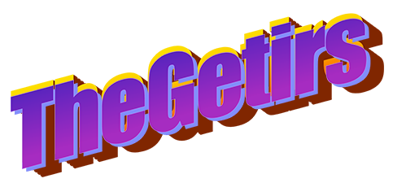

# The Getris's FM Synth

## Folder structure
```bash
.
├── README.md
├── UGen graphs
│   ├── fm1.pdf
│   ├── fm2.pdf
│   ├── fm3.pdf
│   ├── fm4.pdf
│   └── master.pdf
├── images
│   ├── algo1-3BIANCO.png
│   ├── algo2-2BIANCO.png
│   ├── algo3-1BIANCO.png
│   ├── algoCascataBIANCO.png
│   └── realegetir.png
├── report HW1 - TheGetirs.pdf
└── sc
    └── FMSynth.scd
```

## Introduction 
Our project consists in the design of a synthesizer based on the FM synthesis.


## Operators

We have implemented a synth with 4 operators. Each one can be turned on by clicking on his label, and can be used to generate 4 different type of signals (Sine, Saw, Triangle and Pulse Train). It can also be customized through 3 knobs: Coarse, Fine and, one between
* Amplitude, if the operator is a carrier
* ModIndex, if it is a modulator


## Algorithms

The operators can be connected with each other in 4 different algorithms: cascade, parallel, triple carrier and triple modulator. In the left section of the interface, the user can select which scheme to use, and can also see the chain connections through a window. In order to further visualize the output result, we have implemented two buttons: "Scope", that opens an oscilloscope, and "Freqscope", that opens a frequency spectrum analyzer. In this section is also placed a Low Pass Filter button that allows the user to applya filterint to the output signal moving the mouse left or right, controlling the cutoff frequency, and bottom and top, controlling resonance.


## Envelope section 

Under the algorithms section, we have implemented an envelope section. 4 types of envelopes can be selected through a dropdown window: ADSR, ASR, triangle and perc. The user can also choose the duration of the envelope that can go from 1 to 4 seconds. 
The envelope shape can be customized through the designing section in which you can move the dots to modify the parameters of the envelope, with a graphic feedback.


## Authors
 

Di Palma - Gargiulo - Orsatti - Morena - Perego